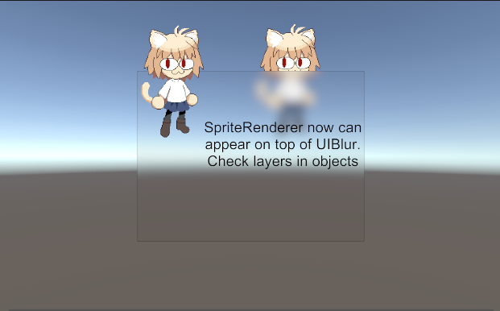
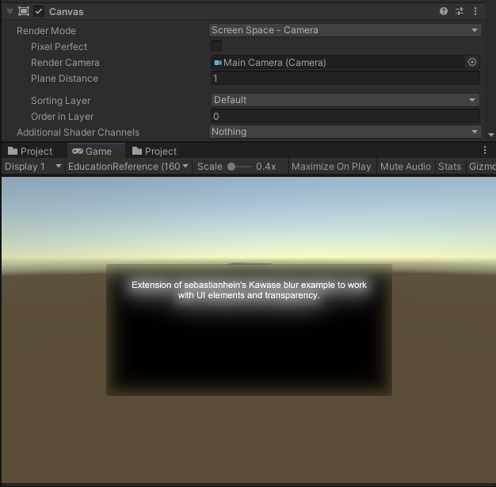

## Universal Render Pipeline UI Blur Renderer Extension (with rendering SpriteRenderer on top of UI Blur)

Fork from [ArneBezuijen](https://github.com/ArneBezuijen)'s UI Blur implementation. Which is work fine with canvas Render Mode setted as "Screen Space - Overlay". 
But thats mean we cant render Sprites on top. Changing Render Mode to "Screen Space - Camera" will render this:

Basically all i done to fix this is just added two new layers "BlurLayer" (for canvas) and "DrawOnTop" (for drawing on top of Blur) and rendering that layers in separate RenderPasses (check ForwardRenderer asset).

Developed with Unity 2020.3.36f but "fix" should work fine in 2019.3 too

## Previous read me from [ArneBezuijen](https://github.com/ArneBezuijen):
[sebastianhein](https://github.com/sebastianhein)'s [urp_kawase_blur](https://github.com/sebastianhein/urp_kawase_blur) implementation is a great example of an efficient blur implementation as a Renderer Extension. It however doesn't work well with UI elements. This fork is intended as an example on how it can be extended for this purpose. 

Usage:
* Add Kawase blur to your Renderer Features of your Forward Renderer asset
* Set the Render Pass Event to after Rendering
* Select the UIBlur material for any UI sprite you want to have a blurred background

Limitations:
* This implementation does not yet support blurring UI elements themselves

Developed with Unity 2019.3
